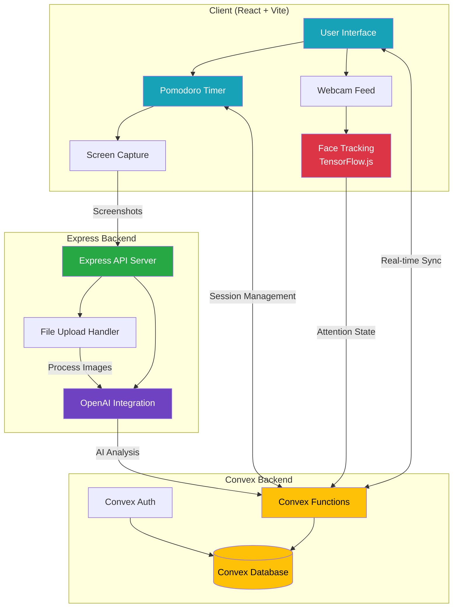
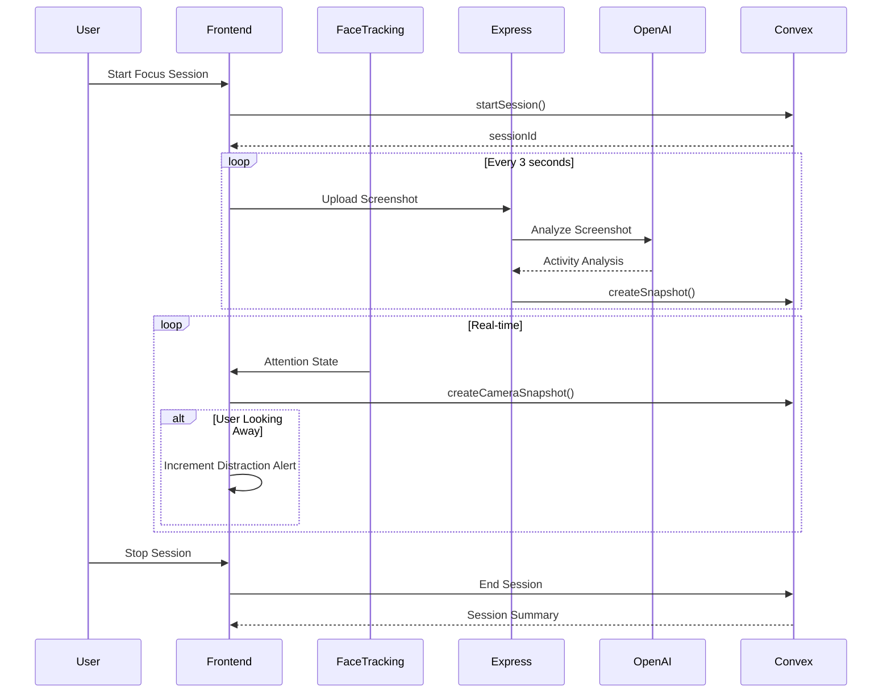

# DillyDally  
### **See your focus. Improve your focus.**

DillyDally is a next-generation, AI-powered Pomodoro system that doesn't just track **how long** you work — it helps you understand **how well** you were able to focus. Traditional productivity timers assume that time spent = progress. But in a world of constant interruptions, simply measuring time is no longer enough.

DillyDally passively monitors subtle indicators of attention (like tab switching or gaze drift) and uses an LLM to generate **personalized Focus Reports** at the end of every work session — helping you understand your distraction patterns and train deeper focus.

Focus isn't a timer.  
**Focus is a trainable skill.**  
DillyDally helps you develop it.

---

## 🏗️ System Architecture



---

## 🔄 Data Flow



---

## The Problem
Most Pomodoro timers only record **time spent**, not **focus quality**.

Which means you can complete 4 sessions and still feel like:
- Nothing meaningful got done
- You were fighting distractions the whole time
- You have no idea *why* your attention slipped

**Focus leaks are invisible. DillyDally makes them visible.**

---

## Our Solution
DillyDally adds **intelligent reflection** to the Pomodoro method:

1. Start a session.
2. The client periodically captures small, privacy-safe context signals.
3. The backend generates **micro-insights** using an LLM.
4. At session end, micro-insights are aggregated into a **Focus Report**, showing:
   - Moments of deep focus
   - Distraction triggers
   - Behavior patterns
   - Personalized recommendations

This creates a **feedback loop**, turning ordinary Pomodoros into skill-building sessions.

---

## Monorepo Architecture

```
DillyDally/
├── convex/                     # Shared Convex backend functions
│   ├── schema.ts              # Database schema
│   ├── functions.ts           # Query/mutation logic
│   ├── auth.ts                # Authentication setup
│   └── tsconfig.json
├── dillydally-frontend/       # React + Vite frontend
│   ├── src/
│   │   ├── App.tsx           
│   │   ├── components/        # UI Components
│   │   ├── utils/             # Face tracking utilities
│   │   └── main.tsx          
│   └── vite.config.ts
├── dillydally-express/        # Express.js backend server
│   ├── src/index.ts          
│   ├── package.json
│   └── tsconfig.json
├── package.json               # Workspace configuration
└── vercel.json                # Deployment config
```

### Tech Stack

| Layer | Technology |
|------|------------|
| Frontend UI | React 19 + TypeScript + Vite |
| Face Tracking | TensorFlow.js + MediaPipe Face Mesh |
| Backend API | Express.js + Node.js |
| Database / Realtime Backend | **Convex** (Backend-as-a-Service) |
| Authentication | Convex Auth (Password-based) |
| AI Processing | OpenAI GPT-4 Vision |
| File Upload | Multer |
| Dev Utilities | TSX, Concurrently, Turbo, ESLint |

---

## Features

- ⏱️ **Smart Pomodoro Timer** with customizable durations
- 👁️ **Real-time Face Tracking** - detects when you look away
- 📸 **Automated Screenshot Capture** - periodic screen monitoring
- 🤖 **AI-powered Activity Analysis** via OpenAI Vision API
- 📊 **Live Distraction Alerts** - real-time attention feedback
- 🔐 **Secure Authentication** via Convex Auth
- 💾 **Real-time Database Sync** - all data stored in Convex
- 📱 **Responsive Design** - works on desktop and tablet

---

## Setup Instructions

### 1. Install Dependencies
```bash
npm install
```

### 2. Initialize Convex
```bash
npx convex dev
```
This will:
- Prompt GitHub login
- Create `.env.local` with `CONVEX_URL`
- Generate `/convex/_generated` types

### 3. Configure Environment Variables

**Root `.env.local`:**
```env
CONVEX_URL=<your-convex-url>
OPENAI_API_KEY=<your-openai-key>
```

**`dillydally-frontend/.env.local`:**
```env
VITE_CONVEX_URL=<your-convex-url>
VITE_EXPRESS_URL=http://localhost:3001
```

**`dillydally-express/.env.local`:**
```env
CONVEX_URL=<your-convex-url>
OPENAI_API_KEY=<your-openai-key>
PORT=3001
```

### 4. Run All Services Together
```bash
npm run dev
```

| Service | URL |
|--------|-----|
| Frontend | http://localhost:5173 |
| Backend API | http://localhost:3001 |
| Convex dev server | Cloud-hosted |

### Run Services Individually
```bash
npx convex dev
npm run dev --workspace=dillydally-frontend
npm run dev --workspace=dillydally-express
```

---

## API Endpoints (Express)

### POST `/api/screenshots`
Upload a screenshot for AI analysis.

**Request:**
- Content-Type: `multipart/form-data`
- Body: 
  - `image`: Screenshot file
  - `ts`: Timestamp
  - `sessionId`: Session identifier

**Response:**
```json
{
  "success": true,
  "message": "Screenshot processed",
  "analysis": {
    "activity": "Coding",
    "isProductive": true,
    "summary": "Working on React components"
  }
}
```

---

## Convex Functions

### Schema (`schema.ts`)

```ts
users          // Auth users
sessions       // Focus sessions
snapshots      // Screenshot analysis results
cameraSnapshots // Face tracking attention states
tasks          // Todo items
```

### Key Functions

- `currentUser`: Get authenticated user
- `startSession`: Create new focus session
- `createSnapshot`: Save screenshot analysis
- `createCameraSnapshot`: Save attention state
- `getSessionActivities`: Get unique activities per session

---

## Development Workflow

| Task | Work In |
|------|--------|
| UI + Interactions | `dillydally-frontend/src/` |
| API logic | `dillydally-express/src/` |
| Database / backend logic | `convex/` |

Convex automatically syncs & regenerates types live.

---

## Troubleshooting

| Issue | Fix |
|------|-----|
| `CONVEX_URL` missing | Ensure `npx convex dev` was run once |
| Missing Convex types | Run Convex dev server |
| Express cannot connect | Ensure `.env.local` exists in repo root |
| Ports in use | Change via Vite config or `PORT` env var |
| Face tracking not working | Allow webcam permissions in browser |
| Screenshots not uploading | Check Express server is running on port 3001 |

---

## Production Deployment

### Frontend (Vercel)
```bash
npm run build
```
The `vercel.json` is configured for monorepo deployment.

### Backend (Railway/Heroku)
```bash
npm run build --workspace=dillydally-express
npm run start --workspace=dillydally-express
```

### Convex Deploy
```bash
npx convex deploy
```

---

## What Makes DillyDally Different

| Traditional Productivity Tools | **DillyDally** |
|---|---|
| Only track time | Measures *quality* of focus |
| No awareness of distraction patterns | Detects attention drift + context triggers |
| No personalized learning | Generates supportive AI reflections & guidance |
| Treat focus as fixed | Treats focus as a *skill that improves* |

DillyDally is not a timer —  
**it's a coach for your attention.**

---

### **See your focus. Improve your focus.**

```
Built with intention, curiosity, and deep work energy ✨☕
HackPrinceton 2025
```
