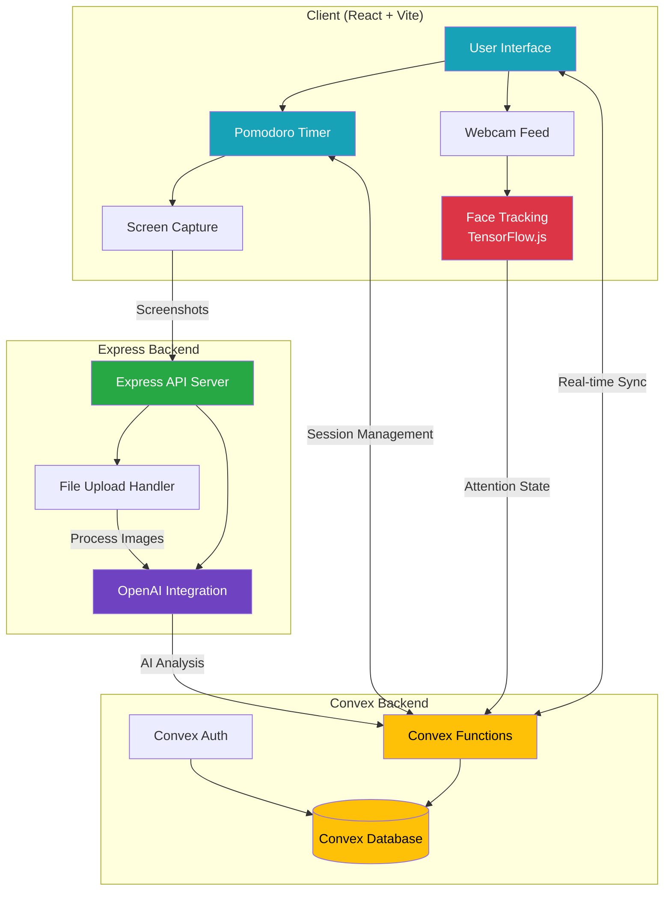

# DillyDally  
### **See your focus. Improve your focus.**

DillyDally is a next-generation, AI-powered Pomodoro system that doesn't just track how long you worked, but how well you worked. Traditional productivity timers assume that time spent = progress. But in a world of constant interruptions, simply measuring time is no longer enough.

DillyDally passively monitors subtle indicators of attention (like tab switching or gaze drift) and uses an LLM to generate a personalized focus report at the end of every work session. 

By adding intelligent reflection and personalized analytics to the Pomodoro method, DillyDally helps you understand your distraction patterns and train deeper focus.

## Features

- Smart Pomodoro Timer with customizable durations
- Real-time Face Tracking that detects when you look away
- Screen Montioring with data collection and deeper analytics
- AI-powered data analysis 


---

## Tech Stack

| Layer | Technology |
|------|------------|
| Frontend UI | React 19 + TypeScript + Vite |
| Face Tracking | TensorFlow.js + MediaPipe Face Mesh |
| Backend API | Express.js + Node.js |
| Database / Realtime Backend | **Convex** (Backend-as-a-Service) |
| Authentication | Convex Auth (Password-based) |
| AI Processing | OpenAI |
| File Upload | Multer |
| Dev Utilities | TSX, Concurrently, Turbo, ESLint |


## System Architecture



---

## Monorepo Architecture

```
DillyDally/
├── convex/                     # Shared Convex backend functions
│   ├── schema.ts              # Database schema
│   ├── functions.ts           # Query/mutation logic
│   ├── auth.ts                # Authentication setup
│   └── tsconfig.json
├── dillydally-frontend/       # React + Vite frontend
│   ├── src/
│   │   ├── App.tsx           
│   │   ├── components/        # UI Components
│   │   ├── utils/             # Face tracking utilities
│   │   └── main.tsx          
│   └── vite.config.ts
├── dillydally-express/        # Express.js backend server
│   ├── src/index.ts          
│   ├── package.json
│   └── tsconfig.json
├── package.json               # Workspace configuration
└── vercel.json                # Deployment config
```

---

## Setup Instructions

### 1. Install Dependencies
```bash
npm install
```

### 2. Initialize Convex
```bash
npx convex dev
```
This will:
- Prompt GitHub login
- Create `.env.local` with `CONVEX_URL`
- Generate `/convex/_generated` types

### 3. Configure Environment Variables

**Root `.env.local`:**
```env
CONVEX_URL=<your-convex-url>
OPENAI_API_KEY=<your-openai-key>
```

**`dillydally-frontend/.env.local`:**
```env
VITE_CONVEX_URL=<your-convex-url>
VITE_EXPRESS_URL=http://localhost:3001
```

**`dillydally-express/.env.local`:**
```env
CONVEX_URL=<your-convex-url>
OPENAI_API_KEY=<your-openai-key>
PORT=3001
```

### 4. Run All Services Together
```bash
npm run dev
```

| Service | URL |
|--------|-----|
| Frontend | http://localhost:5173 |
| Backend API | http://localhost:3001 |
| Convex dev server | Cloud-hosted |

### Run Services Individually
```bash
npx convex dev
npm run dev --workspace=dillydally-frontend
npm run dev --workspace=dillydally-express
```

---

## API Endpoints (Express)

### POST `/api/screenshots`
Upload a screenshot for AI analysis.

**Request:**
- Content-Type: `multipart/form-data`
- Body: 
  - `image`: Screenshot file
  - `ts`: Timestamp
  - `sessionId`: Session identifier

**Response:**
```json
{
  "success": true,
  "message": "Screenshot processed",
  "analysis": {
    "activity": "Coding",
    "isProductive": true,
    "summary": "Working on React components"
  }
}
```

---

## Convex Functions

### Schema (`schema.ts`)

```ts
users          // Auth users
sessions       // Focus sessions
snapshots      // Screenshot analysis results
cameraSnapshots // Face tracking attention states
tasks          // Todo items
```

### Key Functions

- `currentUser`: Get authenticated user
- `startSession`: Create new focus session
- `createSnapshot`: Save screenshot analysis
- `createCameraSnapshot`: Save attention state
- `getSessionActivities`: Get unique activities per session

---

## Development Workflow

| Task | Work In |
|------|--------|
| UI + Interactions | `dillydally-frontend/src/` |
| API logic | `dillydally-express/src/` |
| Database / backend logic | `convex/` |

Convex automatically syncs & regenerates types live.

---

## Troubleshooting

| Issue | Fix |
|------|-----|
| `CONVEX_URL` missing | Ensure `npx convex dev` was run once |
| Missing Convex types | Run Convex dev server |
| Express cannot connect | Ensure `.env.local` exists in repo root |
| Ports in use | Change via Vite config or `PORT` env var |
| Face tracking not working | Allow webcam permissions in browser |
| Screenshots not uploading | Check Express server is running on port 3001 |

---

## Production Deployment

### Frontend (Vercel)
```bash
npm run build
```
The `vercel.json` is configured for monorepo deployment.

### Backend (Railway/Heroku)
```bash
npm run build --workspace=dillydally-express
npm run start --workspace=dillydally-express
```

### Convex Deploy
```bash
npx convex deploy
```

---
Built with intention, curiosity, and deep work energy! 
HackPrinceton 2025 :)
