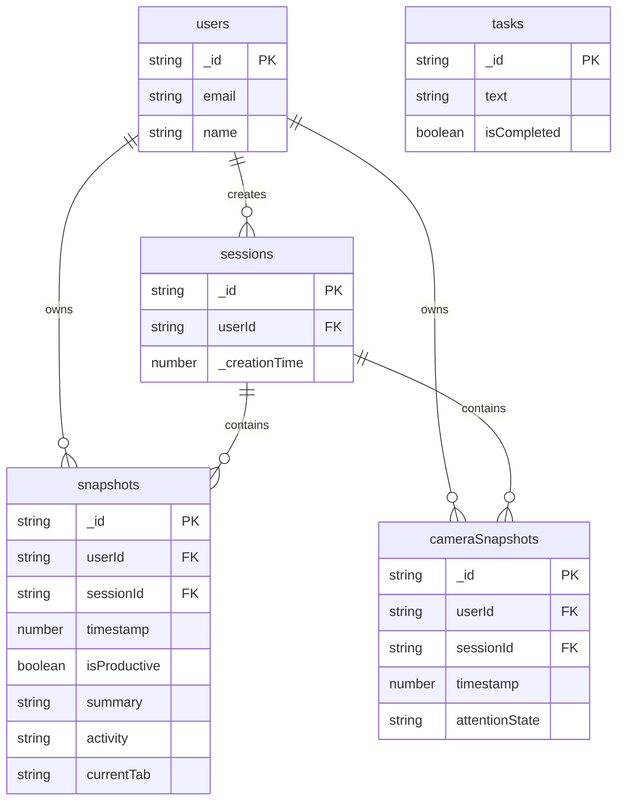

# DillyDally Convex Backend

Convex backend functions and schema for the DillyDally focus tracking application. Provides real-time database, authentication, and serverless functions.

## 🏗️ Architecture

```mermaid
graph TB
    subgraph "Convex Functions"
        Auth[Authentication<br/>@convex-dev/auth]
        Query[Query Functions]
        Mutation[Mutation Functions]
    end
    
    subgraph "Database Tables"
        Users[(users)]
        Sessions[(sessions)]
        Snapshots[(snapshots)]
        Camera[(cameraSnapshots)]
        Tasks[(tasks)]
    end
    
    subgraph "Clients"
        Frontend[React Frontend]
        Express[Express Backend]
    end
    
    Frontend --> Auth
    Frontend --> Query
    Frontend --> Mutation
    Express --> Mutation
    
    Auth --> Users
    Query --> Sessions
    Query --> Snapshots
    Query --> Camera
    Query --> Tasks
    
    Mutation --> Sessions
    Mutation --> Snapshots
    Mutation --> Camera
    Mutation --> Tasks
    
    style Auth fill:#6f42c1,color:#fff
    style Query fill:#17a2b8,color:#fff
    style Mutation fill:#28a745,color:#fff
    style Users fill:#ffc107,color:#000
    style Sessions fill:#ffc107,color:#000
    style Snapshots fill:#ffc107,color:#000
    style Camera fill:#ffc107,color:#000
```

## 📊 Database Schema



## 📁 Project Structure

```
convex/
├── functions.ts            # Core query/mutation functions
├── schema.ts              # Database schema definition
├── auth.ts               # Authentication setup
├── auth.config.ts        # Auth configuration
├── http.ts              # HTTP routes
├── package.json         # Convex-specific dependencies
├── tsconfig.json       # TypeScript configuration
└── _generated/         # Auto-generated types (gitignored)
    ├── api.d.ts
    ├── api.js
    ├── dataModel.d.ts
    └── server.d.ts
```

## 🎯 Functions

### Queries

#### `currentUser`
Get the currently authenticated user.

```typescript
export const currentUser = query({
  args: {},
  handler: async (ctx) => {
    const userId = await getAuthUserId(ctx);
    if (userId === null) return null;
    return await ctx.db.get(userId);
  },
});
```

**Usage:**
```typescript
const user = useQuery(api.functions.currentUser);
```

---

#### `getSessionActivities`
Get unique activity names for a session.

```typescript
export const getSessionActivities = query({
  args: {
    sessionId: v.id("sessions"),
  },
  handler: async (ctx, args) => {
    // Returns array of unique activity strings
  },
});
```

**Usage:**
```typescript
const activities = useQuery(api.functions.getSessionActivities, {
  sessionId: "k1234567890..."
});
// Returns: ["Coding", "Email", "YouTube"]
```

### Mutations

#### `startSession`
Create a new focus session for the authenticated user.

```typescript
export const startSession = mutation({
  args: {},
  handler: async (ctx) => {
    const userId = await getAuthUserId(ctx);
    if (userId === null) {
      throw new Error("Not authenticated");
    }
    const sessionId = await ctx.db.insert("sessions", { userId });
    return sessionId;
  },
});
```

**Usage:**
```typescript
const startSession = useMutation(api.functions.startSession);
const sessionId = await startSession();
```

---

#### `createSnapshot`
Save a screenshot analysis result.

```typescript
export const createSnapshot = mutation({
  args: {
    userId: v.id("users"),
    sessionId: v.id("sessions"),
    timestamp: v.number(),
    isProductive: v.boolean(),
    summary: v.string(),
    activity: v.string(),
    currentTab: v.string(),
  },
  handler: async (ctx, args) => {
    await ctx.db.insert("snapshots", { ...args });
  },
});
```

**Usage:**
```typescript
await convexClient.mutation(api.functions.createSnapshot, {
  userId: user._id,
  sessionId: sessionId,
  timestamp: Date.now(),
  isProductive: true,
  summary: "Working on React components",
  activity: "Coding",
  currentTab: "App.tsx"
});
```

---

#### `createCameraSnapshot`
Save a face tracking attention state.

```typescript
export const createCameraSnapshot = mutation({
  args: {
    userId: v.id("users"),
    sessionId: v.id("sessions"),
    timestamp: v.number(),
    attentionState: v.union(
      v.literal("away_left"),
      v.literal("away_right"),
      v.literal("away_up"),
      v.literal("away_down"),
      v.literal("no_face"),
      v.literal("looking_at_screen")
    ),
  },
  handler: async (ctx, args) => {
    await ctx.db.insert("cameraSnapshots", { ...args });
  },
});
```

**Usage:**
```typescript
await createCameraSnapshot({
  userId: user._id,
  sessionId: sessionId,
  timestamp: Date.now(),
  attentionState: "looking_at_screen"
});
```

## 🗄️ Database Tables

### `users`
Managed by Convex Auth. Contains user authentication data.

**Fields:**
- `_id`: User ID (auto-generated)
- `email`: User email
- `name`: User display name
- Additional auth fields

---

### `sessions`
Focus session records.

**Fields:**
- `_id`: Session ID (auto-generated)
- `userId`: Reference to users table
- `_creationTime`: Auto-generated timestamp

**Indexes:**
- By `userId` for user session queries

---

### `snapshots`
Screenshot analysis results from OpenAI.

**Fields:**
- `_id`: Snapshot ID (auto-generated)
- `userId`: Reference to users table
- `sessionId`: Reference to sessions table
- `timestamp`: Capture time (milliseconds)
- `isProductive`: Binary productivity classification
- `summary`: AI-generated description
- `activity`: Activity category (e.g., "Coding", "YouTube")
- `currentTab`: Active tab/window name

**Indexes:**
- By `sessionId` for session activity queries
- By `userId` for user analytics

---

### `cameraSnapshots`
Face tracking attention states.

**Fields:**
- `_id`: Snapshot ID (auto-generated)
- `userId`: Reference to users table
- `sessionId`: Reference to sessions table
- `timestamp`: Capture time (milliseconds)
- `attentionState`: Enum of attention states
  - `"looking_at_screen"` - Focused
  - `"away_left"` - Looking left
  - `"away_right"` - Looking right
  - `"away_up"` - Looking up
  - `"away_down"` - Looking down
  - `"no_face"` - Face not detected

**Indexes:**
- By `sessionId` for attention analysis
- By `userId` and `timestamp` for time-series queries

---

### `tasks`
Legacy todo items (for demonstration).

**Fields:**
- `_id`: Task ID (auto-generated)
- `text`: Task description
- `isCompleted`: Completion status

## 🔐 Authentication

### Setup

```typescript
// auth.ts
import { convexAuth } from "@convex-dev/auth/server";
import { Password } from "@convex-dev/auth/providers/Password";

export const { auth, signIn, signOut, store, isAuthenticated } = convexAuth({
  providers: [Password],
});
```

### Auth Tables

Convex Auth automatically creates:
- `users` - User accounts
- `authSessions` - Active sessions
- `authAccounts` - Auth provider accounts
- `authVerificationCodes` - Email verification
- `authRefreshTokens` - Token refresh

### Usage in Functions

```typescript
import { getAuthUserId } from "@convex-dev/auth/server";

export const myFunction = mutation({
  handler: async (ctx, args) => {
    const userId = await getAuthUserId(ctx);
    if (userId === null) {
      throw new Error("Not authenticated");
    }
    // User is authenticated, proceed...
  },
});
```

## 🛠️ Tech Stack

| Component | Technology |
|-----------|-----------|
| Platform | Convex Cloud |
| Language | TypeScript 5.3 |
| Runtime | Convex Serverless |
| Auth | @convex-dev/auth 0.0.90 |
| ORM | Convex built-in |
| Validation | Convex validators |

## 🚀 Getting Started

### Prerequisites
- Convex account (sign up at convex.dev)
- Node.js 18+

### Setup

```bash
# Initialize Convex (from monorepo root)
npx convex dev
```

This will:
1. Prompt you to log in via GitHub
2. Create a new Convex project (or select existing)
3. Generate `.env.local` with `CONVEX_URL`
4. Create `convex/_generated/` with TypeScript types
5. Deploy your functions
6. Start watching for changes

### Environment Variables

After running `npx convex dev`, your `.env.local` will contain:

```env
CONVEX_URL=https://your-deployment.convex.cloud
CONVEX_DEPLOYMENT=your-deployment-name
```

### Development Workflow

```bash
# Start development server
npx convex dev

# Deploy to production
npx convex deploy

# View dashboard
npx convex dashboard

# Run data import
npx convex import --table tasks sampleData.jsonl

# Generate types only
npx convex codegen
```

## 📝 Schema Definition

```typescript
import { defineSchema, defineTable } from "convex/server";
import { v } from "convex/values";
import { authTables } from "@convex-dev/auth/server";

export default defineSchema({
  ...authTables,
  
  sessions: defineTable({
    userId: v.id("users"),
  }),
  
  snapshots: defineTable({
    userId: v.id("users"),
    sessionId: v.id("sessions"),
    timestamp: v.number(),
    isProductive: v.boolean(),
    summary: v.string(),
    activity: v.string(),
    currentTab: v.string(),
  }),
  
  cameraSnapshots: defineTable({
    userId: v.id("users"),
    sessionId: v.id("sessions"),
    timestamp: v.number(),
    attentionState: v.union(
      v.literal("away_left"),
      v.literal("away_right"),
      v.literal("away_up"),
      v.literal("away_down"),
      v.literal("no_face"),
      v.literal("looking_at_screen")
    ),
  }),
  
  tasks: defineTable({
    text: v.string(),
    isCompleted: v.boolean(),
  }),
});
```

## 🔧 Adding New Functions

### Query Example

```typescript
export const getSessionStats = query({
  args: {
    sessionId: v.id("sessions"),
  },
  handler: async (ctx, args) => {
    const snapshots = await ctx.db
      .query("snapshots")
      .filter((q) => q.eq(q.field("sessionId"), args.sessionId))
      .collect();
    
    const productive = snapshots.filter(s => s.isProductive).length;
    const total = snapshots.length;
    
    return {
      productivePercentage: (productive / total) * 100,
      totalSnapshots: total,
    };
  },
});
```

### Mutation Example

```typescript
export const endSession = mutation({
  args: {
    sessionId: v.id("sessions"),
    finalNotes: v.string(),
  },
  handler: async (ctx, args) => {
    await ctx.db.patch(args.sessionId, {
      endTime: Date.now(),
      notes: args.finalNotes,
    });
  },
});
```

## 📊 Querying Data

### Filter & Collect

```typescript
const snapshots = await ctx.db
  .query("snapshots")
  .filter((q) => q.eq(q.field("sessionId"), sessionId))
  .collect();
```

### Order & Limit

```typescript
const recentSessions = await ctx.db
  .query("sessions")
  .order("desc")
  .take(10);
```

### Get by ID

```typescript
const session = await ctx.db.get(sessionId);
```

## 🐛 Troubleshooting

| Issue | Solution |
|-------|----------|
| `CONVEX_URL` not found | Run `npx convex dev` first |
| Types not generating | Restart `npx convex dev` |
| Function not found | Check function is exported in `functions.ts` |
| Schema mismatch | Update schema and redeploy |
| Auth errors | Verify `authTables` is spread in schema |
| ID validation error | Ensure using correct table ID type |

## 🚢 Deployment

### Deploy to Production

```bash
# Deploy functions and schema
npx convex deploy

# Set environment variables
npx convex env set SOME_KEY value
```

### Production URL

After deployment, you'll get a production URL:
```
https://your-prod-deployment.convex.cloud
```

Update your production `.env`:
```env
CONVEX_URL=https://your-prod-deployment.convex.cloud
```

### Multiple Environments

```bash
# Deploy to prod
npx convex deploy --prod

# Deploy to staging
npx convex deploy --staging
```

## 📈 Monitoring

### Dashboard

Access the Convex dashboard:
```bash
npx convex dashboard
```

Features:
- View all tables and data
- Monitor function calls
- Check error logs
- Manage environment variables
- View deployment history

### Logs

Function logs appear in:
- Convex dashboard (Logs tab)
- Terminal running `npx convex dev`

```typescript
// Logging in functions
console.log("User created session:", sessionId);
console.error("Error processing:", error);
```

## 🔒 Security

### Best Practices
1. **Always validate input** with Convex validators
2. **Check authentication** in sensitive functions
3. **Use TypeScript** for type safety
4. **Validate IDs** match expected table types
5. **Set proper indexes** for query performance
6. **Rate limit** in production (via Convex dashboard)

### Example Secure Function

```typescript
export const deleteSession = mutation({
  args: { sessionId: v.id("sessions") },
  handler: async (ctx, args) => {
    const userId = await getAuthUserId(ctx);
    if (!userId) throw new Error("Not authenticated");
    
    const session = await ctx.db.get(args.sessionId);
    if (!session) throw new Error("Session not found");
    
    // Check ownership
    if (session.userId !== userId) {
      throw new Error("Unauthorized");
    }
    
    await ctx.db.delete(args.sessionId);
  },
});
```

## 📚 Resources

- [Convex Docs](https://docs.convex.dev)
- [Convex Auth Docs](https://labs.convex.dev/auth)
- [TypeScript Guide](https://docs.convex.dev/typescript)
- [Schema Definition](https://docs.convex.dev/database/schemas)

---

**Part of the DillyDally monorepo** - See main README for full system documentation.
