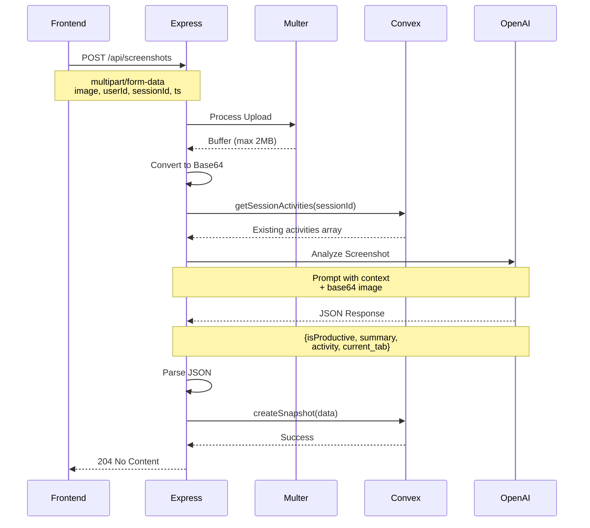

# DillyDally Express Backend

Express.js backend server that handles screenshot uploads and AI-powered activity analysis for the DillyDally focus tracking application.

## 🏗️ Architecture

```mermaid
graph TB
    subgraph "Express Server"
        API[Express API]
        Multer[Multer Upload Handler]
        Route[/api/screenshots endpoint]
    end
    
    subgraph "External Services"
        OpenAI[OpenAI GPT-4.1 Mini<br/>Vision API]
        Convex[(Convex Database)]
    end
    
    subgraph "Data Flow"
        Upload[Screenshot Upload]
        B64[Base64 Encoding]
        Context[Get Session Context]
        Analyze[AI Analysis]
        Store[Store Snapshot]
    end
    
    Route --> Multer
    Multer --> Upload
    Upload --> B64
    B64 --> Context
    Context --> Convex
    Convex --> Analyze
    Analyze --> OpenAI
    OpenAI --> Store
    Store --> Convex
    
    style API fill:#28a745,color:#fff
    style OpenAI fill:#6f42c1,color:#fff
    style Convex fill:#ffc107,color:#000
    style Analyze fill:#17a2b8,color:#fff
```

## 🔄 Request Flow



## 📁 Project Structure

```
dillydally-express/
├── src/
│   ├── index.ts              # Main server file
│   └── lib/
│       └── api.js           # Convex API exports
│
├── dist/                    # Compiled JavaScript
├── package.json
├── tsconfig.json
├── nodemon.json            # Dev server config
└── .env.local              # Environment variables
```

## 🎯 Key Features

### 1. **Screenshot Upload & Processing**
- Accepts multipart/form-data uploads
- 2MB file size limit
- In-memory buffer storage (no disk writes)
- Base64 encoding for AI analysis

### 2. **AI-Powered Activity Analysis**
- OpenAI GPT-4.1 Mini Vision API
- Binary productivity classification
- Activity categorization with context
- Smart activity grouping (reuses existing categories)

### 3. **Session Context Awareness**
- Queries existing activities for the session
- Provides context to AI for consistent categorization
- Reduces activity fragmentation

### 4. **Convex Integration**
- Direct Convex HTTP client
- Creates snapshots with analysis results
- Queries session activities
- Type-safe API calls

## 🚀 API Endpoints

### `GET /`
Health check endpoint.

**Response:**
```json
{
  "status": "ok",
  "message": "DillyDally Express API is running",
  "convexConnected": true
}
```

---

### `POST /api/screenshots`
Upload a screenshot for AI analysis and storage.

**Request:**
- Content-Type: `multipart/form-data`
- Max file size: 2MB

**Form Fields:**
| Field | Type | Required | Description |
|-------|------|----------|-------------|
| `image` | File | Yes | Screenshot image (JPEG/PNG) |
| `userId` | String | Yes | Convex user ID |
| `sessionId` | String | Yes | Convex session ID (32+ chars) |
| `ts` | Number | No | Timestamp (defaults to current time) |

**Response:**
- Status: `204 No Content` (success)
- Status: `400 Bad Request` (missing fields or invalid ID format)
- Status: `500 Internal Server Error` (processing failed)

**Error Response:**
```json
{
  "success": false,
  "error": "Error message"
}
```

**Process:**
1. Validate uploaded file and required fields
2. Convert image buffer to base64
3. Query existing session activities from Convex
4. Send to OpenAI Vision API with context
5. Parse AI response JSON
6. Store snapshot in Convex database
7. Return 204 No Content

**AI Analysis Output:**
```json
{
  "isProductive": true,
  "summary": "Working on React components in VS Code",
  "activity": "Coding",
  "current_tab": "App.tsx"
}
```

## 🛠️ Tech Stack

| Component | Technology |
|-----------|-----------|
| Runtime | Node.js |
| Framework | Express.js 4.18 |
| Language | TypeScript 5.3 |
| File Upload | Multer 2.0 |
| AI Service | OpenAI GPT-4.1 Mini |
| Database Client | Convex HTTP Client |
| Environment | dotenv 16.3 |
| Dev Tools | tsx, nodemon |

## 🚀 Getting Started

### Prerequisites
- Node.js 18+
- npm 10+
- OpenAI API key
- Convex deployment URL

### Installation

```bash
# Install dependencies (from monorepo root)
npm install

# Or install for this workspace only
npm install --workspace=dillydally-express
```

### Environment Variables

Create `.env.local` in the project root:

```env
CONVEX_URL=https://your-deployment.convex.cloud
OPENAI_API_KEY=sk-...
PORT=3001
```

| Variable | Description | Required |
|----------|-------------|----------|
| `CONVEX_URL` | Convex deployment URL | Yes |
| `OPENAI_API_KEY` | OpenAI API key | Yes |
| `PORT` | Server port (default: 3001) | No |

**Note:** The server loads `.env.local` from both the project root (`../`) and the workspace directory to support monorepo setup.

### Development

```bash
# Run development server (with auto-reload)
npm run dev

# Build TypeScript
npm run build

# Run production server
npm start

# Type check only
npm run check-types
```

### Testing the API

```bash
# Health check
curl http://localhost:3001

# Upload screenshot (requires multipart/form-data)
curl -X POST http://localhost:3001/api/screenshots \
  -F "image=@screenshot.png" \
  -F "userId=your-user-id" \
  -F "sessionId=your-session-id" \
  -F "ts=1234567890"
```

## 📊 OpenAI Integration

### Prompt Structure

The system sends a structured prompt to OpenAI Vision API:

```
Evaluate what the user is doing in the image to provide a binary 
classification of whether the user is doing something productive or not. 
Use your observations to populate the following json schema:

{
  isProductive: bool,
  summary: string,
  current_tab: string | null // if not inside of a browser,
  activity: string // 1-2 word phrase max ex: YouTube, Instagram, Essay Writing
}

Existing activities for this session: [Coding, Email, Slack]
Please try to classify the image into one of these existing activity 
categories if it reasonably fits.
```

### Activity Categorization

The AI is context-aware:
- Queries existing activities for the session
- Attempts to reuse existing categories
- Creates new categories when necessary
- Keeps activities concise (1-2 words)

### Response Parsing

```typescript
{
  isProductive: boolean,      // true if work-related
  summary: string,           // Brief description
  activity: string,          // Category (e.g., "Coding", "YouTube")
  current_tab: string | null // Active tab/window
}
```

## 🔧 Configuration

### Multer Settings
```typescript
{
  storage: memoryStorage(),
  limits: {
    fileSize: 2 * 1024 * 1024 // 2MB
  }
}
```

### CORS
All origins allowed (configure for production).

### TypeScript Config
```json
{
  "target": "ES2022",
  "module": "ES2022",
  "moduleResolution": "bundler"
}
```

### Nodemon Config
```json
{
  "watch": ["src"],
  "ext": "ts,json",
  "exec": "tsx src/index.ts"
}
```

## 🐛 Error Handling

| Error Type | HTTP Status | Description |
|------------|-------------|-------------|
| No image file | 400 | Missing image in form data |
| Missing userId | 400 | userId field required |
| Missing sessionId | 400 | sessionId field required |
| Invalid sessionId format | 400 | ID must be 32+ characters |
| OpenAI parsing error | 500 | AI response not valid JSON |
| Convex snapshot error | 500 | Failed to save to database |
| General processing error | 500 | Unexpected server error |

### Logging

The server provides detailed console logs:
```
[Screenshot] User ID: xxx, Session ID: yyy
[Screenshot 1234567890] base64 length: 123456, prefix: /9j/4AAQ...
[Session abc123] Found 3 existing activities: Coding, Email, Slack
[Snapshot] Created snapshot for session abc123
```

## 🚢 Deployment

### Build for Production

```bash
npm run build
```

Output: `dist/index.js`

### Run Production Server

```bash
npm start
```

### Environment Setup (Production)

Set these environment variables in your hosting platform:
- `CONVEX_URL`
- `OPENAI_API_KEY`
- `PORT` (optional, defaults to 3001)

### Recommended Platforms
- **Railway** - Easy deployment with GitHub integration
- **Heroku** - Classic PaaS option
- **Fly.io** - Modern container platform
- **Render** - Simple deployment

### Health Monitoring

Monitor the `/` endpoint for health checks:
```bash
curl https://your-domain.com/
```

## 🔒 Security Considerations

### Current Setup (Development)
- CORS: All origins allowed
- File size: Limited to 2MB
- Authentication: Relies on userId/sessionId from client

### Production Recommendations
1. **Restrict CORS** to your frontend domain
2. **Add API authentication** (API keys, JWT tokens)
3. **Validate userId/sessionId** against Convex auth
4. **Rate limiting** on upload endpoint
5. **Input sanitization** for all fields
6. **HTTPS only** in production
7. **Environment variable encryption**

## 📈 Performance

### Optimizations
- In-memory buffer storage (no disk I/O)
- Efficient base64 encoding
- Connection pooling with Convex
- No file cleanup needed

### Metrics
- Average request time: ~2-4 seconds
  - Upload: ~100ms
  - OpenAI analysis: ~1.5-3s
  - Convex storage: ~200ms
- Max file size: 2MB
- Concurrent requests: Depends on Node.js event loop

## 🐛 Troubleshooting

| Issue | Solution |
|-------|----------|
| Port already in use | Run: `lsof -ti:3001 \| xargs kill -9` |
| CONVEX_URL not set | Run `npx convex dev` in monorepo root |
| OpenAI API error | Check API key and credits |
| Multer upload fails | Verify Content-Type: multipart/form-data |
| Invalid sessionId | Ensure ID is from 'sessions' table (32+ chars) |
| TypeScript errors | Run `npm run build` to check |

## 📝 Development Notes

### Adding New Endpoints

```typescript
app.post("/api/your-endpoint", async (req, res) => {
  try {
    // Your logic here
    res.json({ success: true });
  } catch (error) {
    console.error("Error:", error);
    res.status(500).json({ success: false, error: error.message });
  }
});
```

### Convex Queries/Mutations

```typescript
// Query
const data = await convexClient.query(api.functions.yourQuery, {
  arg: value
});

// Mutation
await convexClient.mutation(api.functions.yourMutation, {
  arg: value
});
```

### OpenAI API Calls

```typescript
const response = await client.responses.create({
  model: "gpt-4.1-mini",
  input: [{
    role: "user",
    content: [
      { type: "input_text", text: "Your prompt" },
      { type: "input_image", image_url: `data:image/jpeg;base64,${base64}` }
    ]
  }]
});
```

---

**Part of the DillyDally monorepo** - See main README for full system documentation.

