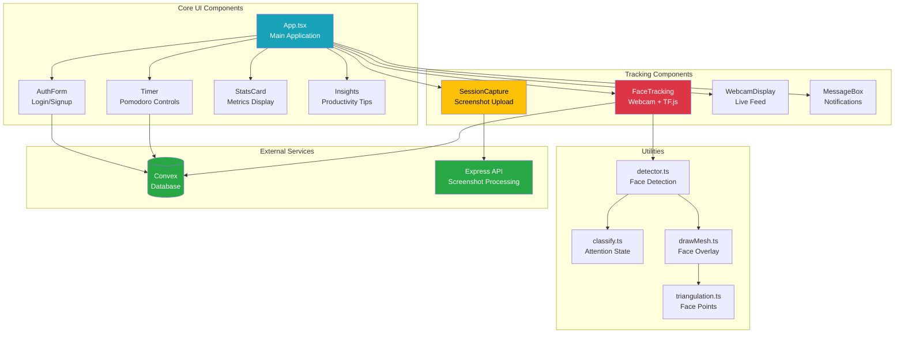
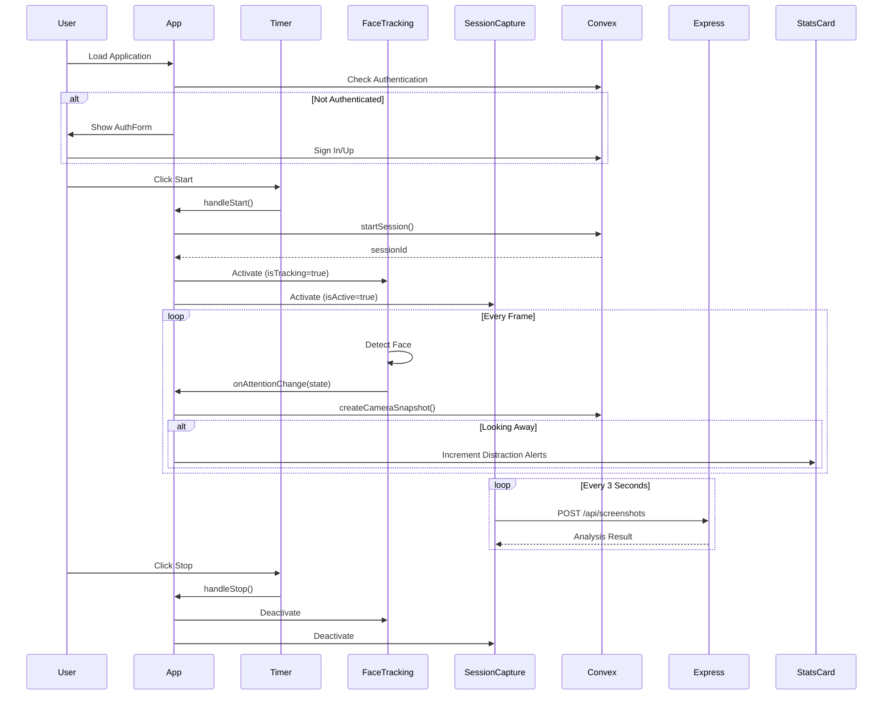

# DillyDally Frontend

React + TypeScript + Vite frontend for the DillyDally focus tracking application.

## 🏗️ Architecture



## 📁 Project Structure

```
dillydally-frontend/
├── src/
│   ├── App.tsx                    # Main application component
│   ├── main.tsx                   # Application entry point
│   ├── App.css                    # Global app styles
│   ├── index.css                  # Base styles
│   │
│   ├── components/
│   │   ├── AuthForm.tsx          # User authentication
│   │   ├── FaceTracking.tsx      # Webcam + face detection
│   │   ├── Insights.tsx          # Productivity insights
│   │   ├── MessageBox.tsx        # Notification display
│   │   ├── SessionCapture.tsx    # Screenshot capture
│   │   ├── StatsCard.tsx         # Metric cards
│   │   ├── Timer.tsx             # Pomodoro timer
│   │   └── WebcamDisplay.tsx     # Live webcam feed
│   │
│   ├── utils/
│   │   └── faceTracking/
│   │       ├── classify.ts       # Attention state classification
│   │       ├── detector.ts       # TensorFlow face detection
│   │       ├── drawMesh.ts       # Face mesh rendering
│   │       └── triangulation.ts  # Face landmark points
│   │
│   ├── lib/
│   │   └── convexApi.ts         # Convex API exports
│   │
│   ├── styles/
│   │   ├── Timer.css
│   │   ├── StatsCard.css
│   │   ├── WebcamDisplay.css
│   │   └── MessageBox.css
│   │
│   └── assets/
│       └── logo.png
│
├── public/
│   └── favicon.png
│
├── vite.config.ts               # Vite configuration
├── tsconfig.json                # TypeScript configuration
└── package.json                 # Dependencies
```

## 🔄 Component Data Flow



## 🎯 Key Features

### 1. **Pomodoro Timer**
- Three modes: Focus (25m), Short Break (5m), Long Break (15m)
- Editable timer durations (click on time display)
- Circular progress indicator
- Start/Stop/Reset controls

### 2. **Face Tracking**
- Real-time face detection using TensorFlow.js
- MediaPipe Face Mesh model
- Detects attention states:
  - Looking at screen
  - Looking left/right/up/down
  - No face detected
- Saves attention data to Convex database

### 3. **Screen Capture**
- Automatic screenshot every 3 seconds during active session
- Uploads to Express backend for AI analysis
- Configurable quality and resolution
- Uses `requestVideoFrameCallback` for efficiency

### 4. **Live Webcam Display**
- Shows real-time webcam feed
- Color-coded attention status:
  - 🟢 Green: Looking at screen
  - 🔴 Red: Looking away
  - ⚫ Gray: No face detected

### 5. **Real-time Stats**
- Breaks taken counter
- Distraction alerts tracker
- Compact display below timer

### 6. **Authentication**
- Convex Auth integration
- Password-based authentication
- Persistent sessions

## 🛠️ Tech Stack

| Category | Technology |
|----------|-----------|
| Framework | React 19 |
| Build Tool | Vite 7 |
| Language | TypeScript 5.9 |
| AI/ML | TensorFlow.js 4.22 |
| Face Detection | MediaPipe Face Mesh |
| Backend | Convex 1.28 |
| Auth | @convex-dev/auth |
| Webcam | react-webcam 7.2 |

## 🚀 Getting Started

### Prerequisites
- Node.js 18+
- npm 10+

### Installation

```bash
# Install dependencies
npm install

# Set up environment variables
cat > .env.local << EOF
VITE_CONVEX_URL=your_convex_url_here
VITE_EXPRESS_URL=http://localhost:3001
EOF
```

### Development

```bash
# Run frontend only
npm run dev

# Build for production
npm run build

# Preview production build
npm run preview

# Type check
npm run check-types

# Lint
npm run lint
```

### Environment Variables

| Variable | Description | Example |
|----------|-------------|---------|
| `VITE_CONVEX_URL` | Convex deployment URL | `https://xxx.convex.cloud` |
| `VITE_EXPRESS_URL` | Express backend URL | `http://localhost:3001` |

## 📦 Key Dependencies

```json
{
  "react": "^19.1.1",
  "convex": "^1.28.2",
  "@tensorflow/tfjs": "^4.22.0",
  "@tensorflow-models/face-landmarks-detection": "^1.0.6",
  "@mediapipe/face_mesh": "^0.4.1633559619",
  "react-webcam": "^7.2.0"
}
```

## 🎨 UI Layout

```
┌─────────────────────────────────────────────────┐
│              Header (Logo + Settings)           │
├──────────────────┬──────────────────────────────┤
│   LEFT COLUMN    │      RIGHT COLUMN            │
│                  │                              │
│  ┌──────────┐   │   ┌─────────────────────┐   │
│  │  Timer   │   │   │   Webcam Display    │   │
│  │  Circle  │   │   │  + Attention Text   │   │
│  └──────────┘   │   └─────────────────────┘   │
│  ┌──────────┐   │                              │
│  │  Modes   │   │   ┌─────────────────────┐   │
│  └──────────┘   │   │   Message Box       │   │
│  ┌──────────┐   │   │  (Future messages)  │   │
│  │ Buttons  │   │   └─────────────────────┘   │
│  └──────────┘   │                              │
│  ┌──────────┐   │                              │
│  │  Stats   │   │                              │
│  └──────────┘   │                              │
└──────────────────┴──────────────────────────────┘
│           Insights Section                      │
└─────────────────────────────────────────────────┘
```

## 🔧 Configuration

### Vite Config
- React plugin enabled
- Path alias: `@convex` points to `../convex`
- Optimized dependencies: `react`, `react-dom`, `convex/react`

### TypeScript Config
- Strict mode enabled
- Target: ES2020
- Module resolution: Bundler
- React JSX runtime

## 🐛 Troubleshooting

| Issue | Solution |
|-------|----------|
| Face tracking not working | Grant webcam permissions in browser |
| Screenshots not capturing | Check Express server is running |
| Convex connection error | Verify `VITE_CONVEX_URL` is set correctly |
| Build fails on Vercel | Ensure optional dependencies are installed |
| TensorFlow errors | Clear node_modules and reinstall |

## 📝 Development Notes

### Face Tracking Implementation
- Uses hidden webcam component for detection
- Separate visible webcam for user display
- Processes frames at ~30fps
- Attention state computed from head rotation (yaw/pitch)

### Screenshot Capture Flow
1. `getDisplayMedia()` captures screen
2. Canvas draws and compresses frame
3. `toBlob()` converts to JPEG
4. `FormData` uploads to Express
5. Express analyzes with OpenAI
6. Results saved to Convex

### State Management
- Local React state for UI
- Convex for persistent data
- Real-time sync via Convex queries

## 🚢 Deployment

### Vercel (Recommended)
```bash
# Build command
npm run build

# Output directory
dist

# Environment variables
VITE_CONVEX_URL=<production-url>
VITE_EXPRESS_URL=<backend-url>
```

### Manual Build
```bash
npm run build
# Output in dist/ directory
```

---

**Part of the DillyDally monorepo** - See main README for full system documentation.
